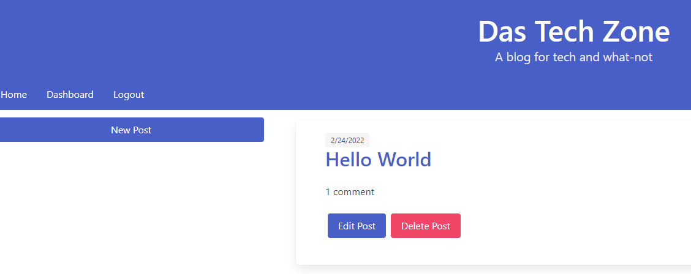

# Tech Blog

'Tech Blog' is a fully functional blog website that allows user signups and handles login sessions.

Once signed in a user can create posts, edit or delete their existing posts and comment on their own and other user's posts.


## License

[MIT](https://choosealicense.com/licenses/mit/)


## Screenshots




## Deployed Application

[Deployed Tech Blog](https://trilogy-tech-blog.herokuapp.com/)
## Installation

To install the application locally, run:

```bash
'npm i'
``` 
This will install all dependencies required to run the application.

Required modules can be reviewed in the package.json.
## Environment Variables

To run this project, you will need to add the following environment variables to your .env file

`DB_NAME='tech_blog_db'`
`DB_USER='root'`
`DB_PW='password'`
`SECRET='asecret'`

Where DB_NAME is an existing SQL database and user/password are valid SQL credentials.


## Run Locally

Lastly run the server with:

```bash
npm start
```

Navigate to either http://localhost:3001/ if running locally, or the domain and port the application is listening on. 